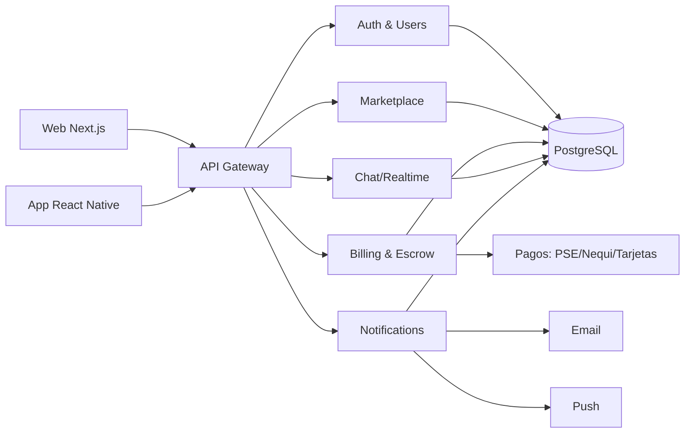
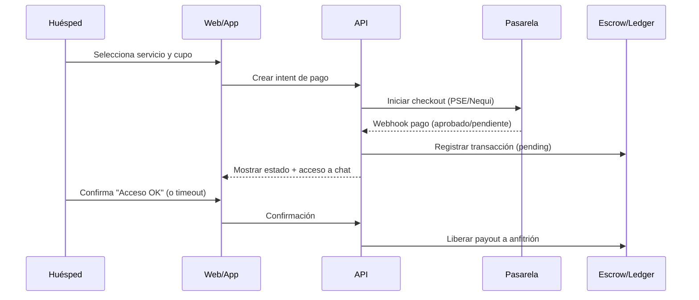

# Plan Empresarial y Técnico (Colombia) — Plataforma para Compartir Suscripciones

Versión: 1.0  
Alcance: Web + móvil (iOS/Android), marketplace de “plazas” para suscripciones multiusuario (Netflix, Spotify, Disney+, Prime Video, etc.), modelo tipo Spliiit adaptado a Colombia.

---

## 0) Resumen Ejecutivo

**Idea:** Una plataforma que conecta **anfitriones** (dueños de una suscripción con cupos libres) con **huéspedes** (personas que buscan una plaza). La plataforma **automatiza cobros**, ofrece **protección de pagos** (escrow), resuelve **disputas**, y agrega **confianza** (KYC básico, reputación, políticas).

**Adaptación Colombia (diferencial):**
- Pagos locales con alta adopción: **Nequi**, **PSE**, tarjetas, transferencias; y plan para **Daviplata**.
- **COP** como moneda nativa; precios “psicológicos” y comisiones transparentes.
- Verificación ligera (KYC básico) y antifraude contextual (dispositivos, IP, patrones).
- Soporte y flujos diseñados para el comportamiento del mercado colombiano: alta preferencia por billeteras y PSE, sensibilidad a comisiones fijas, y fuerte peso de referidos.

---

## 1) Análisis de Modelo de Negocio

### 1.1 Competidores y aprendizajes

#### Spliiit (Europa) — referencia de modelo
**Qué hace bien**
- Marketplace claro: **anfitrión publica plazas** y el huésped compra una.
- Mensaje fuerte de **seguridad**: “o accedes o te devolvemos el dinero”.
- Amplias categorías y navegación sencilla.

**Oportunidades al adaptarlo a Colombia**
- Métodos de pago locales (Nequi/PSE) y UX de recargas.
- Políticas de escrow/disputa ajustadas a la realidad local (tiempos de soporte, verificación).
- Educación al usuario sobre “cómo compartir” sin fricción.

#### Lank (LatAm) — enfoque simple
**Qué hace bien**
- Enfoque educativo y onboarding corto: “elige plataforma, ingresa cupos, crea grupo”.

**Oportunidades**
- Profesionalizar la **protección al huésped** (escrow formal) y la **garantía al anfitrión** (cobro recurrente, antifraude).
- Profundizar en reputación/KYC y atención de disputas.

#### GamsGo — foco en precios agresivos (principalmente gaming/streaming)
**Qué hace bien**
- Propuesta de ahorro fuerte y catálogo con “deals”.

**Riesgos / diferenciación**
- Riesgo de percepción: modelos de reventa/grises en ciertos casos.
- Diferenciarse por **cumplimiento, transparencia, escrow, reputación y soporte**, orientado a “sharing” entre personas con reglas claras.

### 1.2 Propuesta de valor única (UVP) para Colombia

**Para huéspedes**
- Acceso a suscripciones premium con ahorro significativo.
- Pagos locales, protección de transacción y reembolso controlado por reglas.
- Soporte en español y resolución de disputas con SLA.

**Para anfitriones**
- Reducción del costo mensual (hasta “costo cero” o incluso margen pequeño si aplica).
- Cobro automático a huéspedes; menores impagos.
- Herramientas de gestión: cupos, recordatorios, bloqueo/expulsión, historial.

**Para ambos**
- Confianza: verificación básica, reputación, y monitoreo antifraude.

### 1.3 Estructura de tarifas y comisiones (sugerido 5–10%)

#### Componentes recomendados (COP)
1) **Fee plataforma (take rate):** 8% sobre el valor del pago del huésped.  
2) **Fee fijo por transacción (para Colombia):** $900 COP para cubrir costos fijos (pago + operación).  
3) **Costo pasarela:** depende del proveedor (ej. en Colombia, un esquema típico puede ser ~2.65% + $700 COP + IVA sobre comisión; varía por medio de pago).  
4) **Fee de protección/escrow:** incluido dentro del take rate (no se presenta como “costo oculto”; se explica como “Protección de pago”).

**Regla de precio final al huésped (mensual):**
```
Precio huésped = Cuota base + (Cuota base * fee%) + fee fijo
```

**Ejemplo (Spotify Family, cuota base $4.500 COP)**
- fee% 8% = $360
- fee fijo = $900
- total huésped = $5.760 COP

### 1.4 Beneficio para anfitrión (ganancia/ahorro por slot)

El anfitrión tiene dos beneficios:
1) **Ahorro directo** al repartir el costo.
2) **Posible margen** (opcional) mediante un “markup” controlado, sin volver el precio final poco atractivo.

#### Modelo recomendado de “markup controlado”
- El anfitrión define un **markup** entre 0% y 10% sobre la cuota base.
- El markup se destina al anfitrión como “compensación por gestión”.
- La plataforma sigue cobrando el fee de protección al huésped.

**Payout anfitrión por slot (mensual):**
```
Payout por slot = Cuota base * (1 + markup)
```

**Ejemplo (Netflix 4 pantallas; ilustrativo)**
- costo total: $54.900 COP
- cupos huéspedes: 3
- cuota base = 54.900 / 4 ≈ $13.725 COP
- markup anfitrión: 5% → payout por slot = 13.725 * 1.05 ≈ $14.411
- ingreso anfitrión (3 slots) ≈ $43.233
- costo anfitrión ≈ $54.900 → **anfitrión paga neto ≈ $11.667** (ahorro ~79% vs pagar solo)

Si el anfitrión usa markup 0%, su “ganancia” no es monetaria sino ahorro máximo y mayor match-rate.

### 1.5 Ahorro para huésped (vs suscripción individual)

**Ahorro huésped (%)** considerando fee plataforma:
```
Ahorro = 1 - (Precio huésped / Precio individual)
```

**Ejemplo ilustrativo**
- Precio individual: $54.900
- Precio huésped: ~$13.725 + 8% + $900 ≈ $15.723
- Ahorro ≈ 71% (varía por servicio y tamaño del plan)

### 1.6 Proyecciones financieras (12/24/36 meses)

#### Definiciones
- **MAU:** usuarios activos mensuales.
- **Matches activos:** plazas en uso (suscripciones compartidas) en el mes.
- **GMV:** valor total procesado (cobros mensuales) = matches activos * ticket promedio.
- **Ingreso neto:** ingreso plataforma menos costos pasarela/reembolsos/soporte.

#### Supuestos base (ajustables)
- Ticket promedio huésped (pago mensual): **$18.000 COP**
- Fee plataforma: **8% + $900 COP**
- Costo pasarela efectivo promedio: **3.5% + $800 COP** (promedio ponderado por método)
- Tasa de disputa: 2.0% transacciones; reembolso neto 0.8%
- Soporte variable: $250 COP / transacción (atención + herramientas)
- Crecimiento de matches activos: 20% mensual meses 1–6, 12% meses 7–12; 8% año 2; 5% año 3
- Churn de huéspedes: 6% mensual (mejora con reputación y continuidad)

#### Unit economics (por transacción, ticket $18.000)
- Ingreso fee%: 8% * 18.000 = **$1.440**
- Fee fijo: **$900**
- Ingreso bruto: **$2.340**
- Pasarela: 3.5% * 18.000 + 800 = **$1.430**
- Soporte: **$250**
- Reembolsos netos (0.8% * 18.000): **$144**
- **Margen contribución aprox.: $516 por transacción**

#### Escenario Base (matches activos mensuales promedio)
| Horizonte | Matches activos (promedio mes) | Transacciones/año | GMV/año (COP) | Margen contribución/año (COP) |
|---:|---:|---:|---:|---:|
| 12 meses | 3.000 | 36.000 | 648.000.000 | 18.576.000 |
| 24 meses | 12.000 | 144.000 | 2.592.000.000 | 74.304.000 |
| 36 meses | 30.000 | 360.000 | 6.480.000.000 | 185.760.000 |

Notas:
- “Matches activos” representa plazas ocupadas cobradas mensualmente.
- El margen contribución no incluye salarios fijos, marketing, legales, herramientas.

#### Costos fijos estimados (mensual, base)
- Equipo núcleo (lean): PM/Founder, fullstack, móvil, soporte/ops parcial: **$25–45M COP** (según etapa).
- Herramientas (email, monitoreo, KYC, chat, analytics): **$1.5–6M COP**.
- Infraestructura (post-free-tier): **$0.8–4M COP**.

#### Punto de equilibrio (muy aproximado)
Si el margen contribución por transacción es ~$516, para cubrir $35M COP/mes:
- Se requieren **~67.800 transacciones/mes** (~67.800 matches activos)

Implicación: en etapas tempranas conviene:
- Minimizar costos fijos (equipo pequeño + automatización),
- maximizar ticket y take rate efectivo sin destruir conversión (pruebas A/B),
- y crecer por referidos (CAC bajo).

---

## 2) Arquitectura Técnica

### 2.1 Stack tecnológico (open source)

**Frontend web**
- React + Next.js (App Router) o React + Vite.
- UI: Tailwind CSS + Radix UI (componentes accesibles).

**Móvil**
- React Native (Expo) o Flutter.
- Recomendación: React Native para compartir lógica y diseño con React web.

**Backend**
- Node.js (NestJS/Fastify) o Python (FastAPI).
- Recomendación: Node.js (NestJS) por ecosistema de pagos y websockets/chat.

**Base de datos**
- PostgreSQL (recomendado) por transaccionalidad (escrow, ledger).
- Redis para colas y rate limits (opcional al inicio).

**Mensajería/colas**
- Inicial: jobs en la misma app + cron.
- Escala: RabbitMQ o Redis Streams.

**Observabilidad**
- OpenTelemetry + Prometheus/Grafana (self-host) o SaaS gratuito limitado.

### 2.2 Integración de pagos colombianos (Nequi, PSE, Bancolombia, Daviplata)

**Estrategia recomendada**
- Implementar un “Payment Provider Adapter” (abstracción).
- Comenzar con un proveedor con soporte fuerte para **PSE** y **Nequi**.
- Agregar un segundo proveedor para cobertura de **Daviplata** si el primero no lo soporta nativamente.

**Rutas de pago**
- **Checkout** (tarjeta/PSE/Nequi) con redirección o widget.
- **Webhooks** para confirmar estados (aprobado, rechazado, pendiente).
- **Reintentos** y conciliación diaria.

### 2.3 Escrow / fideicomiso (protección de pagos)

**Objetivo:** Reducir fraude y aumentar confianza (huésped paga, anfitrión entrega acceso).

**Modelo operativo (mensual)**
1) Huésped paga → fondos entran a “cuenta plataforma” (escrow lógico).
2) Huésped marca “acceso OK” o el sistema infiere éxito tras un período (ej. 48h sin disputa).
3) Se libera payout al anfitrión menos reglas internas si hay saldo bloqueado/depósito.

**Ledger (contabilidad interna)**
- Wallet por usuario: `available`, `pending`, `locked`.
- Cada transacción genera asientos contables (doble partida simplificada):
  - `cash_in_transit` ↔ `user_pending` ↔ `host_available` ↔ `platform_revenue`.

### 2.4 Microservicios (escalabilidad)

Arranque monolito modular; separar servicios cuando el tráfico lo exija.



Servicios candidatos:
- **Auth/User** (KYC, reputación, perfiles)
- **Marketplace** (publicaciones, búsqueda, match)
- **Billing/Escrow** (pagos, ledger, payouts, reembolsos)
- **Notifications** (email/push)
- **Chat** (WebSocket)
- **Risk/Fraud** (reglas, scoring)

### 2.5 Plan de despliegue gratuito (cloud)

**Opción A (rápida y gratuita al inicio)**
- Web: Vercel (free) o Cloudflare Pages.
- Backend: Render (free tiers) o Fly.io (créditos) o Cloud Run free tier (según región).
- DB: Supabase free (Postgres).
- Storage: Supabase Storage (free).

**Opción B (AWS Free Tier)**
- Frontend: S3 + CloudFront.
- Backend: EC2 t2/t3 micro o Lambda + API Gateway.
- DB: RDS free tier (limitado) o Aurora Serverless v2 (con cuidado de costos).

**Opción C (Firebase)**
- Frontend hosting + Functions + Firestore (rápido), pero menos “ledger-friendly” que Postgres.

Recomendación: Postgres desde el día 1 para escrow y contabilidad.

---

## 3) Desarrollo de Aplicación (especificaciones ejecutables)

### 3.1 Móvil (iOS/Android)

**Stack recomendado**
- React Native + Expo (EAS Build).
- Notificaciones push: Expo Push + fallback a FCM/APNS cuando escale.

**Módulos**
- Auth y onboarding
- Marketplace (búsqueda, filtros, detalle)
- Checkout (PSE/Nequi)
- Mis grupos (estado, pagos, cupos)
- Chat
- Wallet (saldo, retiros, depósitos)
- Perfil + reputación + verificación

### 3.2 Panel web (usuarios y admin)

**Panel usuario**
- Crear publicación (anfitrión) / unirse (huésped)
- Ver pagos, historial, disputas
- Wallet y retiros

**Panel admin (operación)**
- Disputas y reembolsos
- Gestión antifraude (bloqueos, flags)
- Métricas y conciliación
- Catálogo de servicios y categorías

### 3.3 KYC básico (verificación de identidad)

**Fase 1 (ligera)**
- Validación celular (OTP)
- Validación email
- Validación de “titularidad” de método de pago (microcargo/validación)

**Fase 2 (pro)**
- Documento + selfie (proveedor KYC)
- Liveness y verificación de listas si aplica (dependiendo de riesgo)

### 3.4 Chat integrado

Casos:
- Anfitrión comparte instrucciones de acceso.
- Coordinación de perfiles (cuando aplique).

Implementación:
- WebSocket (Socket.IO) o Pusher open source self-host (centrifugo).
- Moderación automática básica: rate limit, filtros.

### 3.5 Reputación y calificaciones

**Señales**
- Pagos a tiempo
- Disputas iniciadas/perdidas
- Tiempo promedio de resolución
- Antigüedad y verificación

**Output**
- Score 0–100
- Badges: “Verificado”, “Paga a tiempo”, “Anfitrión top”.

### 3.6 Notificaciones push y email

Eventos:
- Pago aprobado/pending/rechazado
- Recordatorio de renovación (T-3, T-1)
- Expulsión / cupo liberado
- Disputa creada/resuelta

---

## 4) Aspectos Legales y de Seguridad (Colombia)

### 4.1 Marco legal: sharing economy y riesgos

Enfoque de cumplimiento:
- La plataforma facilita el **pago y la coordinación** entre personas para planes multiusuario donde el servicio lo permita.
- Debe evitar lenguaje que sugiera “reventa” no autorizada.
- Documentar reglas: solo planes que soporten multiusuario/perfiles, y cumplimiento de términos del proveedor cuando aplique.

### 4.2 Términos y privacidad (Ley 1581/2012 – Habeas Data)

Requerimientos:
- Autorización expresa de tratamiento de datos.
- Finalidad clara (pagos, seguridad, soporte).
- Derechos del titular (consultar, actualizar, suprimir).
- Política de cookies y analítica.
- Encargados/terceros (pasarela, email, hosting).

### 4.3 Cumplimiento financiero (SFC) y alcance

Recomendación práctica:
- Operar como **plataforma tecnológica** con escrow lógico y reglas de reembolso.
- Evitar promesas de rendimientos financieros.
- Si el modelo evoluciona a custodiar fondos por tiempos largos o productos financieros, evaluar asesoría para encaje regulatorio.

### 4.4 Seguridad
- TLS/SSL obligatorio.
- Encriptación en reposo (DB managed) y en tránsito.
- Tokenización y no almacenar datos sensibles de tarjeta.
- Secret management (Vault/Secret Manager).
- Auditoría: logs inmutables de eventos críticos (pagos, cambios de cuenta, retiros).

### 4.5 GDPR / localización
- GDPR si se atienden usuarios UE; de lo contrario, diseñar “privacy by default”.
- Minimización de datos: no pedir datos innecesarios.

---

## 5) Estrategia de Lanzamiento (Go-to-Market)

### 5.1 Marketing digital (Colombia)
- TikTok/Instagram Reels: casos reales de ahorro (“ahorré $X al mes”).
- Influencers micro (universidades, tech, entretenimiento).
- SEO: “compartir Netflix Colombia”, “Spotify familiar barato”, “dividir suscripciones”.
- Contenido educativo: guías por plataforma y buenas prácticas.

### 5.2 Adquisición (CAC vs LTV)

**Palancas para CAC bajo**
- Referidos (doble incentivo: huésped y anfitrión).
- Viralidad natural por invitaciones para completar cupos.
- Partnerships (universidades, coworkings, comunidades tech).

**LTV**
- LTV crece con:
  - retención (renovación automática),
  - expansión (más de una suscripción por usuario),
  - reputación (menor churn por problemas).

### 5.3 Programa de referidos
- Bono en wallet al completar el primer pago exitoso.
- Reglas antifraude: limitar multi-cuentas, device fingerprinting.

### 5.4 Alianzas
- Universidades (ferias, embajadores).
- Zonas urbanas: coworkings, residencias, colivings.
- Comunidades: grupos de Telegram/WhatsApp (con moderación).

### 5.5 Roadmap (3, 6 y 12 meses)

**0–3 meses (MVP)**
- Marketplace básico (publicar/unirse)
- Checkout (PSE/Nequi + tarjetas)
- Escrow lógico + disputas simples
- Notificaciones email
- Panel admin de disputas

**3–6 meses**
- React Native app
- Reputación v1
- KYC básico (OTP + verificación método pago)
- Chat v1
- Automatización de conciliación y payouts

**6–12 meses**
- Antifraude avanzado
- KYC pro según riesgo
- Motor de precios (A/B fees)
- Expansión catálogo + partnerships

---

## 6) Métricas y KPIs

**Marketplace**
- MAU / WAU / DAU
- Tiempo promedio de match (publicación → cupo ocupado)
- Tasa de conversión (visita → checkout → pago aprobado)

**Retención**
- Retención D30/D60/D90 (huéspedes y anfitriones)
- Churn mensual
- Porcentaje de renovaciones automáticas exitosas

**Finanzas**
- Ticket promedio (COP)
- GMV mensual
- Take rate efectivo (ingreso neto/GMV)
- Margen contribución por transacción

**Riesgo/Calidad**
- Tasa de disputa
- Tasa de fraude confirmada
- Tiempo promedio de resolución
- NPS

---

## 7) Recursos y Presupuesto

### 7.1 Estimación de horas-hombre por módulo (MVP)
| Módulo | Horas (rango) | Perfil |
|---|---:|---|
| Marketplace (CRUD + búsqueda) | 120–200 | Fullstack |
| Billing + Escrow + Ledger | 180–280 | Backend senior |
| Integración pagos + webhooks | 120–200 | Backend |
| Panel admin (disputas/conciliación) | 80–140 | Fullstack |
| Notificaciones (email) | 40–80 | Backend |
| Autenticación + roles | 40–80 | Fullstack |
| Reputación v1 | 40–80 | Backend |
| QA + automatización básica | 80–140 | QA/Fullstack |

### 7.2 Presupuesto 12 meses (orientativo)

**Equipo (lean)**
- 1 backend/fullstack senior
- 1 frontend/web
- 1 móvil (part-time al inicio)
- 1 soporte/ops (part-time)

**Marketing**
- Ads inicial + influencers micro: $5–20M COP/mes (según etapa)

**Operación**
- KYC: costo por verificación (según proveedor)
- Email: costo por volumen

### 7.3 Costos de infraestructura después de free tier
- Postgres administrado (según uso): $200k–$2M COP/mes
- Backend compute: $150k–$1.5M COP/mes
- CDN/Storage: $50k–$500k COP/mes
- Observabilidad: $0–$1M COP/mes (según stack)

### 7.4 Plan de inversión / rondas
- Pre-seed: construir MVP + tracción inicial (retención, unit economics).
- Seed: escalar growth, antifraude, partnerships, soporte.

---

## 8) Flujos de Usuario (ejecutables)

### 8.1 Flujo huésped (unirse)



### 8.2 Flujo anfitrión (publicar)
- Selecciona servicio + plan + número de cupos.
- Define precio base y opcional markup (0–10%).
- Publica y recibe solicitudes/pagos.
- Comparte instrucciones por chat; confirma accesos.

---

## 9) Mockups básicos (baja fidelidad)

### 9.1 Marketplace
```
┌───────────────────────────────────────────┐
│  Buscar: [ Netflix, Spotify, Disney+ ]    │
│  Filtros: Precio  •  Categoría  •  Cupos  │
├───────────────────────────────────────────┤
│  Netflix Premium 4K        $15.700 / mes  │
│  Cupos: 1/3  • Protección incluida        │
│  [Ver detalle]                             │
├───────────────────────────────────────────┤
│  Spotify Family             $5.760 / mes  │
│  Cupos: 2/5  • Verificado ✓               │
│  [Ver detalle]                             │
└───────────────────────────────────────────┘
```

### 9.2 Detalle + Checkout
```
┌───────────────────────────────────────────┐
│ Spotify Family                             │
│ Anfitrión: Verificado ✓  Score 92          │
│ Cuota base: $4.500                         │
│ Protección: 8% + $900                      │
│ Total mensual: $5.760                      │
│                                           │
│ Método de pago: ( ) Nequi  ( ) PSE  ( ) TC │
│ [Pagar y reservar cupo]                    │
└───────────────────────────────────────────┘
```

### 9.3 Wallet + Retiros
```
┌───────────────────────────────────────────┐
│ Saldo disponible: $120.000                 │
│ Saldo pendiente:   $18.000                 │
│ Saldo bloqueado:    $0                     │
│ [Retirar a Nequi]  [Retirar a banco]       │
└───────────────────────────────────────────┘
```

---

## 10) Checklist para iniciar implementación (equipo dev)

**Producto**
- Definir catálogo inicial de servicios (top 20 Colombia) y reglas por plataforma.
- Política de disputas: tiempos, evidencia, reembolsos parciales.

**Técnico**
- Esquema Postgres (users, listings, memberships, payments, ledger_entries, disputes, ratings, messages).
- Integración pasarela v1 + webhooks + conciliación.
- Ledger + estados: `initiated`, `paid_pending`, `released`, `refunded`, `chargeback`.
- Panel admin mínimo (disputas, payouts, flags).

**Legal**
- Borradores: Términos y Privacidad (Ley 1581/2012) + consentimiento explícito.

